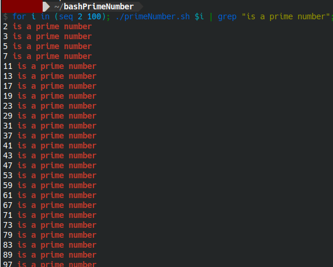
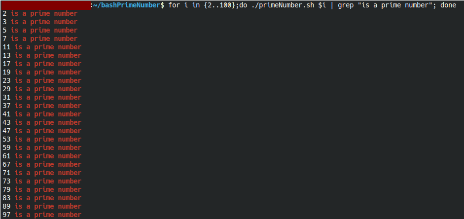

# primeNumber.sh

This script is utilized to ascertain whether the inputted number is a prime number or not.

# How to Use ?

One can employ this script by executing it as provided below.

```
./primeNumber.sh [number]
```

If the inputted number is a prime number, the output will become like this:

```
[number] is a prime number
```

If the inputted number is not a prime number, the output will become like this:

```
[number] is not a prime number
```

# Test result by using number 2 to 100

### 1. Result test of primeNumber.sh by using number 2 to 100 at fish shell when the script is using Bash



### 2. Result Test of primeNumber.sh by using Number 2 to 100 at fish shell when the script is using Bash



